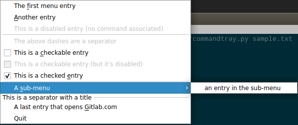

# BeyondTray

BeyondTray is an app for displaying a custom menu in the system tray, for example to have a bunch of easily accessed launchers.

## Example menu

BeyondTray shows a system tray icon with a dynamic, customizable menu.

Given [this menu description](sample1.menu):

```
- The &first menu entry
    xmessage "the first entry was selected"
- &Another entry
    echo "the second entry was selected" >> ~/foobar.txt
- This is a disabled entry (no command associated)
--------
- The above dashes are a separator
- [ ] This is a &checkable entry
    echo "the checkbox was checked" >> ~/foobar.txt
- [ ] This is a checkable entry (but it's disabled)
- [x] This is a checked &entry
    echo "the checkbox was unchecked" >> ~/foobar.txt
--------
> A &sub-menu
    - an entry in the sub-menu
        xmessage "submenu was selected"
-------- This is a separator with a title
- A last entry that opens &Gitlab.com
    firefox https://gitlab.com
```

BeyondTray will show this menu:



The entries that are not disabled (grayed out) can be clicked on, and the associated command will be run when clicked.

## Dynamic

The menu content is dynamic because the menu description is read just when the context menu is about to be shown. The menu description can be read from:

- a custom command that dynamically generates the menu description on stdout
- a static file (that can be edited by an external program)
- a template file, containing static entries and conditions

Furthermore, the menu description is re-read/re-generated every time the user right-clicks on the tray icon.

## Syntax

### Simple entries

A simple entry menu entry is just a bullet entry:

```
- Run xclock
```

but the entry will be disabled because there is no command associated yet. Setting one is just specifying the command below and indented:

```
- Run xclock
    xclock
```

Clicking the entry will run the associated command.

`&` can be used before any letter of an entry title. The letter will be underlined in the menu, and that letter will be the shortcut key to trigger the menu entry.

```
- Run &xclock
    xclock
```

In this example, pressing `x` while the menu is shown will run xclock.

### Checkboxes

Like this:

```
- [ ] unchecked
- [x] checked
```

### Separators

A simple separator is only dashes on the lines (as long as there's more than 3):

```
------
```

A title can be added:

```
------ Separator title
```

### Submenus

Starting with a `>` and the content must be indented:

```
> a submenu
    - a sub-entry
        a command
    - [ ] a checkbox
        another command
```

### Note on indentation

The indentation can be tabs or spaces, as you wish, but it must be consistent in the whole file. For example, if you decide indentation is 4 spaces in your file, every line must be indented by a multiple of 4 spaces.

## Using templating for dynamic content

Templating is useful for dynamic content, for example changing the label of an entry, or making a checkbox really dynamic.
The syntax uses Jinja.

### File: `dynamic.menu.jinja`
```
- date is now: {{ read("date '+%Y-%m-%d %T'") }}
------

- [x] XScreenSaver is running

- [ ] XScreenSaver is not running!
    xscreensaver

```

Run with `beyondtray --template dynamic.menu.jinja`.

See the [jinja manual](https://jinja.palletsprojects.com/en/3.0.x/templates/) for complete description of templating.

## Using a command for dynamic content

### File: `dynamic.sh`
```
#!/bin/sh -e

cat << EOF
- date is now: $(date '+%Y-%m-%d %T')
------
EOF

if pgrep xscreensaver | grep -q .
then
    echo "- [x] XScreenSaver is running"
else
    echo "- [ ] XScreenSaver is not running!"
    echo "    xscreensaver"
fi
```

Run with `beyondtray --command dynamic.sh`.

